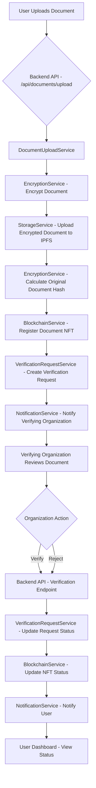

# Technical Overview for Investors

## Introduction

This document provides a high-level technical overview of the platform, designed for investors. Our aim is to demonstrate the robust architecture and operational mechanics of key features, highlighting how our technical design ensures scalability, reliability, efficiency, and a strong competitive advantage in the market. We will focus on the "what" and "why" of our technical choices, rather than delving into low-level implementation details.

## Core Feature 1: Secure Document Upload

The platform prioritizes the security and integrity of user documents from the moment of upload. When a user initiates a document upload, the file is processed through a secure backend service.

A critical step in this process is the encryption of the document content using strong AES-256 encryption, a widely recognized and secure symmetric encryption standard. This ensures that the sensitive information within the document is protected and remains confidential. To manage the encryption keys securely, we employ a system where each document's unique data encryption key (DEK) is generated and then encrypted using a master key. This layered, envelope encryption approach enhances security by limiting the exposure of the master key and provides a scalable mechanism for managing encryption and decryption operations for numerous documents.

For storage, we leverage the InterPlanetary File System (IPFS), a decentralized and distributed network protocol. IPFS provides a resilient and immutable way to store the *encrypted* document data across a global network of nodes. By distributing data storage, we enhance resilience against single points of failure and reduce the risk of data loss or censorship compared to traditional centralized storage. To ensure the long-term availability and accessibility of the encrypted documents on the IPFS network, we utilize Pinata as a reliable pinning service. Pinata guarantees that our data remains persistently available and easily retrievable from the IPFS network. It is crucial to note that only the encrypted data is stored on IPFS; the original, unencrypted document content is never stored there, maintaining user privacy and confidentiality.

This architecture ensures that document uploads are not only efficient but also highly secure and reliable, protecting sensitive data through robust encryption and leveraging the distributed nature of IPFS for resilience and data integrity. The scalability of this storage solution is inherently tied to the distributed nature of IPFS and the capabilities of our pinning service, allowing us to handle a growing volume of documents efficiently.

## Core Feature 2: Document Verification Workflow

The document verification workflow is a cornerstone of the platform, providing a transparent and immutable record of document authenticity. The process is designed for efficiency and trust, leveraging blockchain technology for critical verification status updates:

1.  **User Uploads Document:** A user uploads a document, which is securely handled as described in the previous section, including encryption and storage on IPFS.
2.  **Verification Request Creation:** Upon successful upload and initial processing, a formal verification request is created within the platform's secure database. This request links the user, the encrypted document's reference (e.g., IPFS CID), and the designated verifying organization.
3.  **Organization Review:** The designated verifying organization is notified of the pending request. They can then securely access and decrypt the document content (with appropriate authorization and key management) through their dashboard to review its contents.
4.  **Organization Action (Verify/Reject):** The organization evaluates the document based on their criteria. Based on their assessment, they can either verify the document or reject it, optionally providing a reason for rejection.
5.  **Blockchain Status Update:** This is a key step leveraging blockchain technology. The verification outcome (Verified or Rejected) is recorded on the blockchain using a custom-built DocumentNFT smart contract. This transaction immutably links a unique identifier for the document (derived from its content hash) to its verification status, the identity of the verifying organization, and a timestamp. The blockchain serves as a tamper-proof ledger, providing an undeniable record of the verification event. Importantly, the document's sensitive content is *not* stored on the blockchain, only a cryptographic hash and verification metadata, ensuring privacy while maintaining transparency of the verification status.
6.  **User Notification:** The user who uploaded the document is automatically notified through the platform (e.g., in-app notification, email) of the verification outcome.
7.  **Status View on Dashboard:** The user can view the verified status of their document on their platform dashboard. They can also independently verify the status by querying the blockchain using the document's unique identifier, providing an extra layer of trust and transparency.

The role of the blockchain in this workflow is to provide an immutable and transparent ledger of verification events. This significantly enhances trust and reliability for all parties involved, as the verification status, once recorded on the blockchain, cannot be altered or tampered with. The efficiency of this workflow is maintained by handling document content off-chain (encrypted on IPFS) while using the blockchain specifically for the critical, trust-anchoring verification status.

The smart contract governing the document verification process is a critical component. To ensure its integrity, security, and correct execution, rigorous testing throughout the development lifecycle and independent security audits by reputable third parties are paramount. This commitment to smart contract security is vital for maintaining the trust and reliability of the verification process and the platform as a whole.

Here is a high-level illustration of the Document Verification Workflow:

## Core Feature 3: Authentication and Authorization

Securing user accounts and controlling access to sensitive data and functionalities are fundamental to the platform's trustworthiness and operational integrity. Our authentication and authorization mechanisms are designed with multiple layers of security to protect against unauthorized access and malicious activities:

Users are authenticated through a secure process, typically involving industry-standard protocols and token-based authentication (e.g., using secure tokens like JWTs) to manage user sessions and verify identities for API interactions. This ensures that only legitimate users can access the platform's features. Access to different parts of the application, specific user data, and organizational functionalities is controlled through robust authorization checks. These checks are implemented at the API level, ensuring that users and organizations can only access the resources and perform the actions they are explicitly permitted to, adhering to the principle of least privilege.

Beyond basic authentication and authorization, we have implemented enhanced security measures across the platform to provide a comprehensive defense:

*   **HTTP Header Security:** We utilize industry-standard practices and libraries like `helmet`, along with custom middleware, to set secure HTTP headers. This is a crucial first line of defense that helps protect users against common web vulnerabilities such as Cross-Site Scripting (XSS), clickjacking, and other code injection attacks by controlling how browsers load and interpret content from our domain.
*   **Rate Limiting:** To prevent abuse, protect against denial-of-service (DoS) attacks, and ensure the availability and stability of our services, we implement rate limiting on various API endpoints. This limits the number of requests a single source can make within a specific time frame, effectively mitigating automated attacks like brute-force login attempts.
*   **Input Sanitization:** All user-provided inputs, whether through forms or API requests, are subjected to rigorous validation and sanitization processes. This involves cleaning and filtering data to remove or neutralize potentially malicious content or code snippets, effectively mitigating the risk of injection attacks (like SQL injection or XSS) that could compromise data integrity or system security.
*   **CSRF Protection:** Cross-Site Request Forgery (CSRF) attacks, where an attacker tricks a user into performing unwanted actions on a web application where they are currently authenticated, are prevented through the implementation of CSRF tokens. These unique, per-session tokens ensure that requests made to our backend originate from legitimate user interactions within our application and are not forged by malicious external sites.
*   **Robust Session Management:** We employ secure session management practices to protect the integrity and confidentiality of user sessions. This includes mechanisms for regenerating session IDs upon successful login to prevent session fixation attacks (where an attacker fixes a user's session ID before they log in), implementing session timeouts to automatically terminate inactive sessions and limit the window of opportunity for session hijacking, and other measures to ensure that sessions cannot be easily compromised.

These comprehensive security measures are integrated throughout the platform's backend architecture, providing a strong, multi-layered defense against common web threats and ensuring a secure environment for users and their sensitive data. The scalability of our authentication and authorization system is designed to handle a growing number of users and requests efficiently without compromising performance or security.

## API Architecture

The platform's functionality is exposed through a well-defined API, which serves as the central point of interaction for the frontend application and is designed to be extensible for future integrations with external services and partners. The backend is structured using a modular approach, akin to a microservice architecture, where different core functionalities are handled by distinct, specialized modules or services.

This architectural choice offers significant advantages:

*   **Separation of Concerns:** Each module focuses on a specific business capability (e.g., authentication, document handling), leading to a cleaner, more organized, and easier-to-understand codebase.
*   **Improved Maintainability:** Changes or updates to one module are less likely to impact others, simplifying maintenance and reducing the risk of introducing bugs.
*   **Independent Development and Deployment:** Development teams can work on different modules concurrently, accelerating the development lifecycle. Modules can also be deployed independently, allowing for faster updates and rollbacks.
*   **Enhanced Scalability:** Individual services experiencing high load can be scaled independently by deploying more instances of that specific service, optimizing resource utilization and ensuring performance under varying demand.
*   **Increased Resilience:** If one module encounters an issue, it is less likely to affect the entire system, improving overall system resilience and availability.

This modular design supports scalability and allows for flexible and efficient future expansion of features and integrations.

## Technology Stack and Deployment

The platform is built using a modern and robust technology stack chosen for its performance characteristics, scalability potential, developer productivity, and strong ecosystem and community support:

*   **Backend:** Primarily built with Node.js and the Express.js framework, providing a high-performance, non-blocking I/O environment well-suited for building scalable API services.
*   **Frontend:** Developed using React and the Next.js framework, enabling the creation of dynamic and responsive user interfaces. Next.js provides features like server-side rendering and static site generation, which improve performance, SEO, and developer experience.
*   **Database:** Utilizes Firestore, a NoSQL cloud database provided by Google Cloud Platform. Firestore offers real-time data synchronization, automatic scaling to handle varying loads, and robust querying capabilities, making it suitable for managing user data, organization information, verification requests, and other application data.
*   **Blockchain Interaction:** Interacts with the Ethereum blockchain, specifically using the Sepolia testnet for development and testing, with the intention to deploy on a suitable mainnet for production. We use industry-standard libraries like Ethers.js to interact securely and efficiently with our smart contracts deployed on the blockchain.
*   **Decentralized Storage:** Employs IPFS for decentralized file storage, providing a content-addressable system for storing the encrypted document data. Pinata is used as a reliable pinning service to ensure the long-term persistence and high-speed accessibility of our data on the IPFS network.

The deployment strategy is designed for reliability, scalability, and operational efficiency, typically leveraging cloud-based infrastructure (e.g., on platforms like AWS, Google Cloud, or Azure). The modular nature of the backend services facilitates deployment in containerized environments (like Docker) and orchestration platforms (like Kubernetes). This approach allows for automated scaling based on real-time demand, ensures high availability through redundancy and self-healing capabilities, and contributes to operational efficiency by streamlining deployment and management processes.

## Data Privacy and Compliance

The platform is built with a strong commitment to data privacy and security, recognizing the sensitive nature of the documents being handled and the importance of user trust. Our technical design incorporates robust measures to protect user data throughout its lifecycle, from upload to storage and access.

A core principle is the encryption of sensitive document content *before* it is stored or transmitted for storage. Only the encrypted version of the document is uploaded to IPFS, ensuring that the content remains private and inaccessible to unauthorized parties, even on a decentralized network. Access to decryption keys is strictly controlled and managed through secure mechanisms, ensuring that only authorized users and organizations with the necessary permissions can decrypt and view document content. We also adhere to the principle of least privilege, ensuring that users and system components only have access to the data and functionalities absolutely necessary for their intended purpose.

The platform framework includes provisions for essential legal documentation, such as comprehensive Terms of Use, Terms of Service, and Privacy Policies. These documents are designed to clearly outline user rights, explain how data is collected, used, and protected, detail the security measures in place, and define the responsibilities of both the user and the platform. These documents are crucial for establishing transparency and building user confidence.

We acknowledge the critical importance of complying with relevant data protection and privacy regulations. Our technical architecture and operational procedures are designed with careful consideration for adhering to applicable regulations, including those specific to Southern Africa. This includes understanding and working towards compliance with frameworks such as the Protection of Personal Information Act (POPIA) in South Africa and similar regulations in other Southern African countries. While we cannot provide specific legal advice or guarantees of compliance, the platform's design principles, including strong data encryption, secure access controls, a focus on data minimization where possible, and transparent policies, align with the requirements of many privacy frameworks and demonstrate our commitment to protecting user data in the region.

## Technical Advantages and Competitive Edge

The platform's technical architecture provides several key advantages that contribute to its competitive edge in the market:

*   **Enhanced Security and Privacy:** Multi-layered security measures, including robust authentication, authorization, strong encryption with secure key management, proactive defense against common web vulnerabilities, and a design that prioritizes data privacy by storing only encrypted content on IPFS, build deep trust and protect sensitive data effectively.
*   **Data Integrity and Immutability:** Leveraging blockchain for verification status provides an immutable and transparent record of authenticity, significantly increasing the trustworthiness and verifiability of documents. The use of IPFS for storage also contributes to data integrity through content addressing.
*   **Scalability and Reliability:** The modular API architecture, cloud-based deployment designed for auto-scaling, and the use of scalable technologies like Node.js, React/Next.js, and Firestore enable the platform to handle increasing user load and data volume reliably and efficiently. Decentralized storage via IPFS adds another layer of resilience and availability.
*   **Efficiency:** The streamlined document verification workflow, efficient handling of encrypted data, and the performance characteristics of the chosen technology stack contribute to operational efficiency and a responsive user experience.
*   **Future-Proof and Flexible Architecture:** The modular design allows for easier integration of new features, adaptation to evolving technological landscapes, and compliance with future regulatory requirements. The use of open standards like IPFS and blockchain technology positions the platform for future innovation and interoperability.

These technical strengths collectively position the platform as a secure, reliable, scalable, and innovative solution, providing a strong foundation for growth and a clear competitive advantage.

## Suggestions and Improvements

While the current architecture provides a strong foundation, continuous improvement and adaptation are essential in the rapidly evolving technology landscape. Potential areas for future technical enhancements and optimization include:

*   **Exploring Alternative Storage Solutions:** Investigating other decentralized or distributed storage solutions to potentially optimize cost, performance characteristics (e.g., retrieval speed), or explore features like file versioning or access control at the storage layer.
*   **Enhancing Blockchain Interaction Efficiency:** Exploring layer 2 scaling solutions (e.g., Polygon, Optimism) or alternative blockchain platforms that offer lower transaction costs and higher transaction throughput to improve the efficiency and reduce the cost of recording verification updates on-chain.
*   **Advanced Security Features:** Implementing additional security measures such as multi-factor authentication options for users and organizations, more granular role-based access control policies, continuous security monitoring, intrusion detection systems, and regular penetration testing.
*   **Performance Optimization:** Conducting in-depth performance profiling and optimization of key services, database interactions, and frontend rendering to ensure optimal responsiveness and efficiency under increasing user load.
*   **Automated Compliance and Auditing Tools:** Developing or integrating tools to automate checks against relevant data privacy and compliance regulations and to facilitate technical audits.
*   **Exploring Confidential Computing:** Investigating the use of confidential computing environments for processing sensitive data to add another layer of privacy protection.

These suggestions represent potential avenues for further strengthening the platform's technical capabilities, enhancing security, optimizing performance, and maintaining its competitive advantage in the long term.