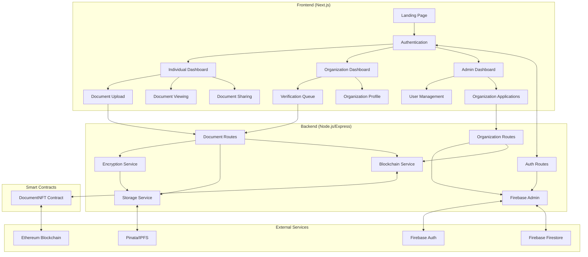
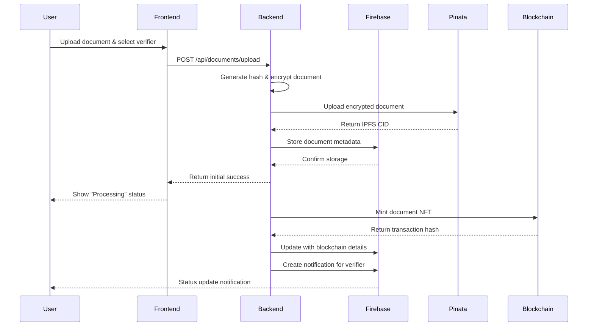
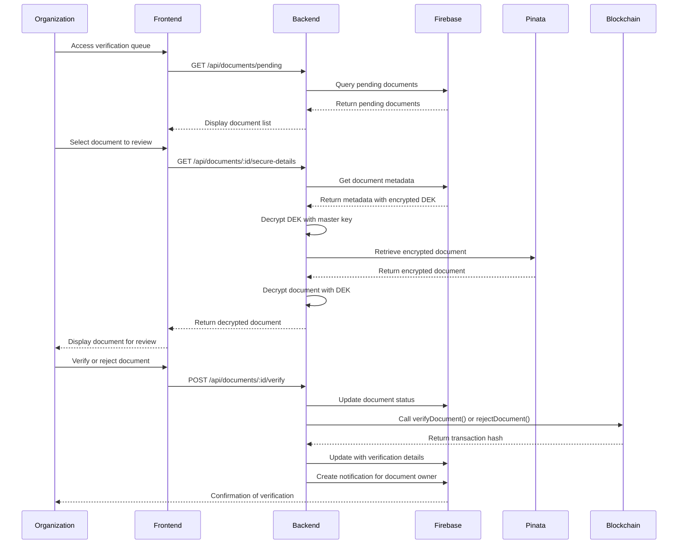
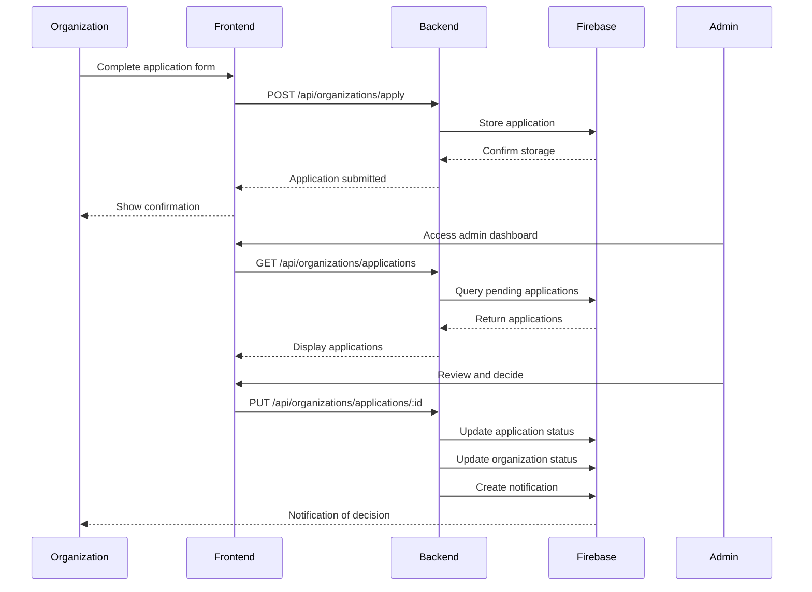
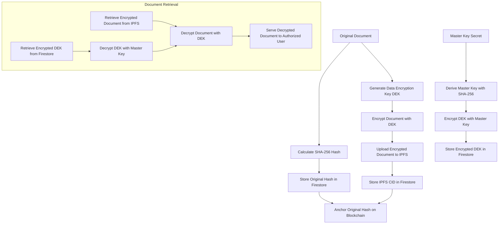
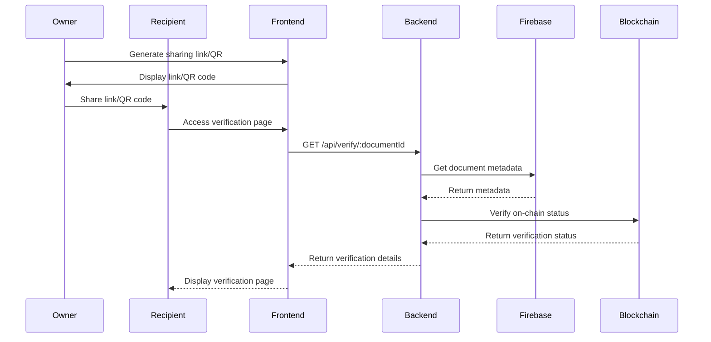

# Authentico Technical Documentation

## Table of Contents

1. [Introduction and Overview](#introduction-and-overview)
2. [Technical Architecture](#technical-architecture)
   - [System Architecture](#system-architecture)
   - [Key Components](#key-components)
   - [Third-Party Services](#third-party-services)
3. [Platform Features and User Flows](#platform-features-and-user-flows)
   - [User Document Upload Process](#user-document-upload-process)
   - [Document Verification Process](#document-verification-process)
   - [Organization Verification Application](#organization-verification-application)
   - [Document Viewing](#document-viewing)
   - [Document Sharing](#document-sharing)
4. [Codebase Structure and Analysis](#codebase-structure-and-analysis)
   - [Project Structure](#project-structure)
   - [Frontend Components](#frontend-components)
   - [Backend Services](#backend-services)
   - [Smart Contracts](#smart-contracts)
5. [Integration and Future Development Guidelines](#integration-and-future-development-guidelines)
   - [Integration Guidelines](#integration-guidelines)
   - [Development Best Practices](#development-best-practices)
   - [Troubleshooting](#troubleshooting)
6. [Conclusion](#conclusion)
7. [References](#references)

## Introduction and Overview

Authentico is a blockchain-based document verification platform that enables secure document management, verification, and sharing. The platform leverages blockchain technology, decentralized storage, and encryption to ensure document authenticity and integrity.

### Core Features

- **Secure Document Upload**: Users can upload documents that are encrypted and stored on IPFS.
- **Blockchain Anchoring**: Document metadata and hashes are anchored on the Ethereum blockchain (Sepolia testnet).
- **Document Verification**: Verified organizations can review and verify documents.
- **Organization Verification**: Organizations can apply for verification status to become document verifiers.
- **Secure Document Sharing**: Users can share verified documents via links and QR codes.
- **Document Viewing**: Secure viewing of encrypted documents with proper authorization.

### Value Proposition

Authentico provides a trustless, decentralized solution for document verification that:

- Eliminates the need for centralized authorities to verify document authenticity
- Reduces fraud through immutable blockchain records
- Simplifies document sharing and verification through QR codes and secure links
- Protects document privacy through end-to-end encryption
- Creates a network of verified organizations that can validate documents

## Technical Architecture

### System Architecture

Authentico is built as a monorepo using npm workspaces with three main components:

1. **Frontend**: Next.js 14 application with App Router
2. **Backend**: Node.js/Express API service
3. **Smart Contracts**: Ethereum smart contracts (Solidity)

The following diagram illustrates the high-level system architecture and component interactions:



### Key Components

#### Frontend (Next.js)

The frontend is built with Next.js 14 using the App Router architecture. Key technologies include:

- **Thirdweb SDK**: For wallet connection and blockchain interactions
- **Firebase Client SDK**: For authentication and Firestore database access
- **Tailwind CSS**: For styling with a neubrutalism design theme
- **Framer Motion**: For animations and transitions

#### Backend (Node.js/Express)

The backend provides API endpoints for the frontend and handles:

- **Authentication**: Using Firebase Admin SDK
- **Document Processing**: Encryption, IPFS storage, and blockchain anchoring
- **Organization Management**: Verification applications and approvals
- **Blockchain Interactions**: Via ethers.js and the sponsor wallet

#### Smart Contracts (Solidity)

The smart contracts are deployed on the Ethereum Sepolia testnet and handle:

- **Document NFTs**: Representing verified documents as non-fungible tokens
- **Verification Status**: Recording document verification status on-chain
- **Ownership**: Managing document ownership and transfer rights

### Third-Party Services

Authentico integrates with several third-party services:

1. **Firebase**

   - **Authentication**: User registration and login
   - **Firestore**: Database for user profiles, document metadata, and organization details
   - **Security Rules**: Access control for Firestore collections

2. **Pinata/IPFS**

   - **Document Storage**: Encrypted documents are stored on IPFS via Pinata
   - **Pinning Service**: Ensures documents remain accessible on IPFS

3. **Thirdweb**

   - **Wallet Connection**: Social login and embedded wallets
   - **Blockchain Interaction**: Simplified interface for blockchain operations

4. **Ethereum Blockchain (Sepolia Testnet)**
   - **Document Anchoring**: Recording document hashes and metadata
   - **Verification Status**: Immutable record of document verification

## Platform Features and User Flows

### User Document Upload Process

The document upload process involves several steps to ensure security and proper anchoring on the blockchain:

1. **User Authentication**:

   - User connects their wallet via Thirdweb
   - Authentication with Firebase is established

2. **Document Selection and Metadata**:

   - User selects a document file
   - User provides document name and type
   - User selects a verifying organization from a dropdown of verified organizations

3. **Upload and Processing**:

   - Frontend sends the document to the backend via a secure API endpoint
   - Backend processes the document:
     - Calculates the original document hash (SHA-256)
     - Generates a Data Encryption Key (DEK)
     - Encrypts the DEK with the master key
     - Encrypts the document with the DEK
     - Uploads the encrypted document to IPFS via Pinata
     - Stores document metadata in Firestore

4. **Blockchain Anchoring**:
   - Backend asynchronously anchors the document on the blockchain:
     - Updates document status to "Submitting to Blockchain"
     - Calls the smart contract to mint an NFT with document metadata
     - Updates document status to "Pending Verification" with transaction details
     - Notifies the verifying organization



### Document Verification Process

The document verification process allows verified organizations to review and verify documents:

1. **Organization Dashboard**:

   - Organization logs in with their wallet
   - Views pending verification requests in their dashboard

2. **Document Review**:

   - Organization selects a document to review
   - Backend securely retrieves and decrypts the document
   - Organization views the decrypted document in the browser

3. **Verification Decision**:

   - Organization approves or rejects the document
   - If rejected, a reason must be provided

4. **Blockchain Confirmation**:
   - Backend updates the document status in Firestore
   - Backend calls the smart contract to update verification status
   - Transaction is confirmed on the blockchain
   - Document owner is notified of the verification result



### Organization Verification Application

Organizations must be verified before they can verify documents:

1. **Application Submission**:

   - Organization registers with a wallet
   - Organization completes the verification application form
   - Application is submitted to the backend

2. **Admin Review**:

   - Admin reviews the application in the admin dashboard
   - Admin approves or rejects the application

3. **Verification Status**:
   - If approved, organization status is updated to "verified"
   - Organization receives notification of approval
   - Organization appears in the dropdown for document verification



### Document Viewing

Secure document viewing is implemented with multiple security layers:

1. **Authorization Check**:

   - Backend verifies the user is authorized to view the document
   - For document owners: Direct access
   - For verifying organizations: Access during verification
   - For shared links: Validation of sharing permissions

2. **Secure Retrieval**:

   - Backend retrieves the encrypted document from IPFS
   - Backend decrypts the document using the DEK
   - Decrypted document is securely streamed to the authorized user

3. **Viewing Options**:
   - Images are displayed directly in the browser
   - PDFs are rendered in an embedded PDF viewer
   - Other file types offer download options

#### Document Encryption Flow

The following diagram illustrates the encryption and decryption process for documents:



### Document Sharing

Users can share verified documents securely:

1. **Sharing Methods**:

   - Generate a verification link
   - Generate a QR code containing the verification link

2. **Verification Page**:

   - Recipients access the verification page via link or QR code
   - Page displays document metadata and verification status
   - Page shows blockchain transaction details for verification
   - Original document content is not displayed on the verification page

3. **Security Measures**:
   - Verification links only show metadata, not document content
   - Blockchain transaction can be verified on Etherscan
   - Document hash can be verified for integrity



## Codebase Structure and Analysis

### Project Structure

Authentico is organized as a monorepo with the following structure:

```
authentico/
├── frontend/         # Next.js 14 application (App Router)
│   ├── app/          # Pages and components
│   ├── lib/          # Utility functions and services
│   ├── public/       # Static assets
│   └── package.json  # Frontend dependencies
├── backend/          # Node.js/Express API service
│   ├── routes/       # API route handlers
│   ├── services/     # Business logic services
│   ├── index.js      # Main server file
│   └── package.json  # Backend dependencies
├── smart_contracts/  # Ethereum smart contracts
│   ├── contracts/    # Solidity contract files
│   ├── test/         # Contract test files
│   └── package.json  # Smart contract dependencies
├── docs/             # Documentation
├── test-scripts/     # End-to-end test scripts
└── package.json      # Root package with workspaces
```

### Frontend Components

#### Key Frontend Files

- **`frontend/app/page.tsx`**: Landing page with wallet connection
- **`frontend/app/layout.tsx`**: Root layout with providers
- **`frontend/app/contexts/AuthContext.tsx`**: Authentication context
- **`frontend/app/individual-dashboard/page.tsx`**: Individual user dashboard
- **`frontend/app/organization-dashboard/page.tsx`**: Organization dashboard
- **`frontend/app/admin/page.tsx`**: Admin dashboard
- **`frontend/app/verify/[docId]/page.tsx`**: Document verification page
- **`frontend/app/apply/organization/page.tsx`**: Organization application form

#### Authentication Flow

The frontend uses Thirdweb for wallet connection and Firebase for authentication:

```typescript
// Example from AuthContext.tsx
const login = useCallback(async (walletAddress: string) => {
  try {
    setLoading(true);
    clearError();
    console.log('Logging in with wallet address:', walletAddress);
    const result = await loginWithWallet(walletAddress);

    if (result.success && result.user) {
      console.log('Login successful, setting user:', result.user);
      setUser(result.user as User);
      // Remove from unregistered wallets if it was there
      if (unregisteredWallets.includes(walletAddress)) {
        console.log('Removing wallet from unregistered list:', walletAddress);
        setUnregisteredWallets((prev) =>
          prev.filter((address) => address !== walletAddress)
        );
      }
      return {
        success: true,
        message: result.message || 'Sign in successful!',
      };
    }
    // ...
  } catch (error) {
    // Error handling
  }
}, []);
```

#### Document Upload Component

The document upload form handles file selection, metadata input, and submission:

```jsx
// Pseudocode for document upload
const handleSubmit = async (e) => {
  e.preventDefault();
  setIsUploading(true);

  try {
    const formData = new FormData();
    formData.append('file', selectedFile);
    formData.append('documentName', documentName);
    formData.append('documentType', documentType);
    formData.append('verifyingOrgId', selectedOrganization);

    const token = await auth.currentUser?.getIdToken();

    const response = await axios.post('/api/documents/upload', formData, {
      headers: {
        'Content-Type': 'multipart/form-data',
        Authorization: `Bearer ${token}`,
      },
    });

    setToastMessage({
      type: 'success',
      message: 'Document uploaded successfully!',
    });

    // Refresh documents list
    fetchDocuments();
  } catch (error) {
    setToastMessage({
      type: 'error',
      message: error.response?.data?.error || 'Failed to upload document',
    });
  } finally {
    setIsUploading(false);
  }
};
```

### Backend Services

#### Key Backend Files

- **`backend/index.js`**: Main server setup and route mounting
- **`backend/config.js`**: Firebase and other configuration
- **`backend/authMiddleware.js`**: Token verification middleware
- **`backend/routes/documentRoutes.js`**: Document-related API endpoints
- **`backend/routes/orgRoutes.js`**: Organization-related API endpoints
- **`backend/services/EncryptionService.js`**: Document encryption/decryption
- **`backend/services/StorageService.js`**: IPFS storage via Pinata
- **`backend/services/BlockchainService.js`**: Blockchain interactions

#### Document Processing

The backend handles document encryption and storage:

```javascript
// Example from documentRoutes.js
// Process the file
const fileBuffer = req.file.buffer;

// Calculate hash of original document
const originalDocHash = EncryptionService.calculateHash(fileBuffer);

// Generate a data encryption key (DEK)
const dek = await EncryptionService.generateKey();

// In a production environment, this would use a KMS service
// For this implementation, we'll use a master key derived from an environment variable
const masterKey = crypto
  .createHash('sha256')
  .update(process.env.MASTER_KEY_SECRET)
  .digest();

// Encrypt the DEK with the master key
const encryptedDek = await EncryptionService.encryptKey(dek, masterKey);

// Encrypt the file with the DEK
const encryptedFile = await EncryptionService.encryptFile(fileBuffer, dek);

// Upload encrypted file to IPFS
const ipfsResponse = await StorageService.uploadToIPFS(
  encryptedFile,
  `${Date.now()}-${req.file.originalname}`,
  { documentType }
);

const encryptedIpfsCid = ipfsResponse.IpfsHash;

// Store document metadata in Firestore
const docRef = await documentsCollection.add({
  ownerUid: req.user.uid,
  ownerName: userData.name || 'Unknown',
  verifyingOrgId,
  verifyingOrgName: orgData.name || 'Unknown',
  documentName,
  documentType,
  documentTypeName: getDocumentTypeName(documentType),
  originalDocHash,
  encryptedIpfsCid,
  encryptedDek: encryptedDek.toString('base64'),
  status: 'Pending Blockchain Submission',
  createdAt: admin.firestore.FieldValue.serverTimestamp(),
  userWalletAddress,
  orgWalletAddress,
  fileSize: req.file.size,
  mimeType: req.file.mimetype,
});
```

#### Blockchain Integration

The BlockchainService handles interactions with the smart contract:

```javascript
// Example from BlockchainService.js
async registerDocument(documentHash, userWalletAddress, orgWalletAddress, documentType, encryptedCid) {
  await this.initialize();

  return await asyncRetry(async () => {
    try {
      // Call the mintDocumentNFT function on the smart contract
      const tx = await this.contract.mintDocumentNFT(
        userWalletAddress,
        encryptedCid,
        userWalletAddress,
        documentHash
      );

      console.log(`Transaction submitted: ${tx.hash}`);

      // Wait for the transaction to be mined
      const receipt = await tx.wait();
      console.log(`Transaction confirmed in block ${receipt.blockNumber}`);

      // Extract the token ID from the event logs
      const event = receipt.events.find(event => event.event === 'DocumentVerified');
      const tokenId = event.args.tokenId.toNumber();

      return {
        transactionHash: tx.hash,
        blockNumber: receipt.blockNumber,
        tokenId: tokenId
      };
    } catch (error) {
      console.error('Error registering document on blockchain:', error);
      throw error;
    }
  }, this.retryOptions);
}
```

### Smart Contracts

The DocumentNFT contract manages document verification on the blockchain:

```solidity
// Example from DocumentNFT.sol
contract DocumentNFT is ERC721, Ownable, ReentrancyGuard {
    uint256 private _tokenIds;
    address public verifier; // Authorized verifier address

    // Mapping token ID to document metadata and verification status
    enum VerificationStatus {
        New,
        Verified,
        Rejected
    }

    struct Document {
        string urlPicture;
        address publicAddress;
        string metadataHash;
        VerificationStatus status;
    }

    mapping(uint256 => Document) private documents;

    // Event to emit when a document is verified
    event DocumentVerified(
        uint256 indexed tokenId,
        address indexed owner,
        string urlPicture,
        address publicAddress,
        VerificationStatus indexed status
    );

    function mintDocumentNFT(
        address to,
        string memory _documentUrl,
        address _publicAddress,
        string memory _metadataHash
    ) external onlyOwner nonReentrant {
        uint256 tokenId = _tokenIds++;
        _safeMint(to, tokenId);

        documents[tokenId] = Document({
            urlPicture: _documentUrl,
            publicAddress: _publicAddress,
            metadataHash: _metadataHash,
            status: VerificationStatus.New
        });

        emit DocumentVerified(
            tokenId,
            to,
            _documentUrl,
            _publicAddress,
            VerificationStatus.New
        );
    }

    function verifyDocument(uint256 tokenId) external {
        require(
            msg.sender == verifier,
            "DocumentNFT: Caller is not the verifier"
        );

        require(
            documents[tokenId].status == VerificationStatus.New,
            "DocumentNFT: Document is already verified or rejected"
        );

        documents[tokenId].status = VerificationStatus.Verified;

        emit DocumentVerified(
            tokenId,
            ownerOf(tokenId),
            documents[tokenId].urlPicture,
            documents[tokenId].publicAddress,
            VerificationStatus.Verified
        );
    }
}
```

## Integration and Future Development Guidelines

### Integration Guidelines

#### Adding New Features

When adding new features to Authentico, follow these guidelines:

1. **Frontend Integration**:

   - Create new pages in the appropriate directory under `frontend/app/`
   - Add new components in `frontend/app/components/`
   - Update navigation and routes as needed
   - Ensure proper authentication checks are in place

2. **Backend Integration**:

   - Add new routes in `backend/routes/`
   - Implement business logic in `backend/services/`
   - Update middleware as needed
   - Document API endpoints

3. **Smart Contract Integration**:
   - Add new functions to existing contracts or create new contracts
   - Write tests for new contract functionality
   - Deploy and verify contracts on the testnet
   - Update ABIs in the frontend and backend

#### Environment Configuration

Ensure proper environment configuration for all components:

1. **Frontend Environment Variables**:

   - Create `.env.local` in the frontend directory
   - Include Firebase configuration
   - Include API URLs and other configuration

2. **Backend Environment Variables**:

   - Create `.env` in the backend directory
   - Include Firebase service account details
   - Include Pinata API keys
   - Include blockchain configuration
   - Set the MASTER_KEY_SECRET for encryption

3. **Smart Contract Deployment**:
   - Configure `hardhat.config.js` with the correct network
   - Set up deployment scripts with proper environment variables

### Development Best Practices

#### Code Organization

- **Modular Components**: Break down UI into reusable components
- **Service Abstraction**: Implement business logic in service classes
- **Clean Architecture**: Separate concerns between layers
- **Type Safety**: Use TypeScript for type checking

#### Security Considerations

- **Authentication**: Always verify user identity and permissions
- **Encryption**: Use proper encryption for sensitive data
- **Input Validation**: Validate all user inputs
- **Error Handling**: Implement proper error handling and logging
- **Rate Limiting**: Implement rate limiting for API endpoints

#### Testing

- **Unit Tests**: Write tests for individual components and services
- **Integration Tests**: Test interactions between components
- **End-to-End Tests**: Test complete user flows
- **Contract Tests**: Test smart contract functionality

### Troubleshooting

#### Common Issues

1. **Authentication Errors**:

   - Check Firebase configuration
   - Verify token handling in the frontend and backend
   - Ensure proper CORS configuration

2. **Document Upload Issues**:

   - Check file size limits
   - Verify Pinata API keys and configuration
   - Check encryption/decryption process

3. **Blockchain Interaction Errors**:

   - Verify contract addresses and ABIs
   - Check wallet configuration and gas settings
   - Ensure proper network configuration

4. **Environment Configuration**:
   - Verify all required environment variables are set
   - Check for typos in configuration values
   - Ensure secrets are properly secured

## Conclusion

Authentico provides a comprehensive solution for secure document verification using blockchain technology. The platform combines modern web technologies, decentralized storage, and smart contracts to create a trustless verification system.

The modular architecture allows for easy extension and integration of new features. The security-first approach ensures document privacy and integrity throughout the verification process.

By following the guidelines in this documentation, developers can understand the current implementation and correctly integrate the remaining features to complete the platform.

## References

- [Next.js Documentation](https://nextjs.org/docs)
- [Firebase Documentation](https://firebase.google.com/docs)
- [Thirdweb Documentation](https://portal.thirdweb.com/)
- [Pinata Documentation](https://docs.pinata.cloud/)
- [Ethereum Documentation](https://ethereum.org/en/developers/docs/)
- [Hardhat Documentation](https://hardhat.org/docs)
- [Solidity Documentation](https://docs.soliditylang.org/)
