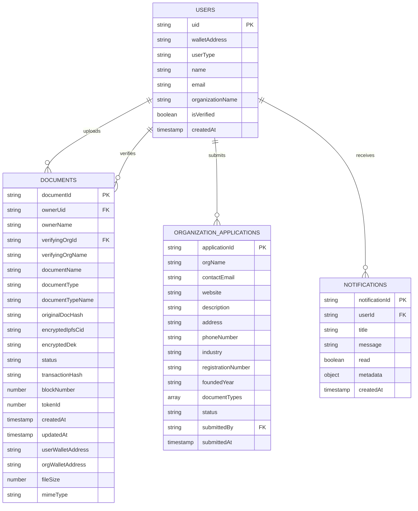

```mermaid
erDiagram
    USERS {
        string uid PK
        string walletAddress
        string userType
        string name
        string email
        string organizationName
        boolean isVerified
        timestamp createdAt
    }
    
    DOCUMENTS {
        string documentId PK
        string ownerUid FK
        string ownerName
        string verifyingOrgId FK
        string verifyingOrgName
        string documentName
        string documentType
        string documentTypeName
        string originalDocHash
        string encryptedIpfsCid
        string encryptedDek
        string status
        string transactionHash
        number blockNumber
        number tokenId
        timestamp createdAt
        timestamp updatedAt
        string userWalletAddress
        string orgWalletAddress
        number fileSize
        string mimeType
    }
    
    ORGANIZATION_APPLICATIONS {
        string applicationId PK
        string orgName
        string contactEmail
        string website
        string description
        string address
        string phoneNumber
        string industry
        string registrationNumber
        string foundedYear
        array documentTypes
        string status
        string submittedBy FK
        timestamp submittedAt
    }
    
    NOTIFICATIONS {
        string notificationId PK
        string userId FK
        string title
        string message
        boolean read
        object metadata
        timestamp createdAt
    }
    
    USERS ||--o{ DOCUMENTS : "uploads"
    USERS ||--o{ ORGANIZATION_APPLICATIONS : "submits"
    USERS ||--o{ DOCUMENTS : "verifies"
    USERS ||--o{ NOTIFICATIONS : "receives"
```
