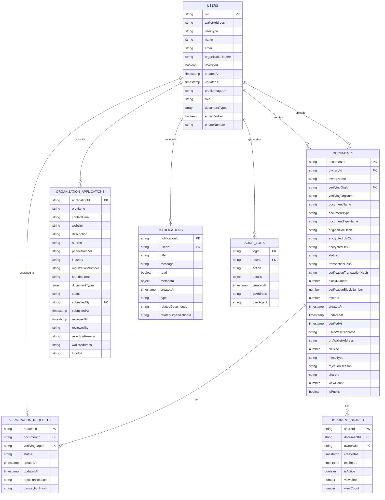

```mermaid
erDiagram
    USERS {
        string uid PK
        string walletAddress
        string userType
        string name
        string email
        string organizationName
        boolean isVerified
        timestamp createdAt
        timestamp updatedAt
        string profileImageUrl
        string role
        array documentTypes
        boolean emailVerified
        string phoneNumber
    }

    DOCUMENTS {
        string documentId PK
        string ownerUid FK
        string ownerName
        string verifyingOrgId FK
        string verifyingOrgName
        string documentName
        string documentType
        string documentTypeName
        string originalDocHash
        string encryptedIpfsCid
        string encryptedDek
        string status
        string transactionHash
        string verificationTransactionHash
        number blockNumber
        number verificationBlockNumber
        number tokenId
        timestamp createdAt
        timestamp updatedAt
        timestamp verifiedAt
        string userWalletAddress
        string orgWalletAddress
        number fileSize
        string mimeType
        string rejectionReason
        string shareId
        number viewCount
        boolean isPublic
    }

    ORGANIZATION_APPLICATIONS {
        string applicationId PK
        string orgName
        string contactEmail
        string website
        string description
        string address
        string phoneNumber
        string industry
        string registrationNumber
        string foundedYear
        array documentTypes
        string status
        string submittedBy FK
        timestamp submittedAt
        timestamp reviewedAt
        string reviewedBy
        string rejectionReason
        string walletAddress
        string logoUrl
    }

    NOTIFICATIONS {
        string notificationId PK
        string userId FK
        string title
        string message
        boolean read
        object metadata
        timestamp createdAt
        string type
        string relatedDocumentId
        string relatedOrganizationId
    }

    VERIFICATION_REQUESTS {
        string requestId PK
        string documentId FK
        string verifyingOrgId FK
        string status
        timestamp createdAt
        timestamp updatedAt
        string rejectionReason
        string transactionHash
    }

    DOCUMENT_SHARES {
        string shareId PK
        string documentId FK
        string ownerUid FK
        timestamp createdAt
        timestamp expiresAt
        boolean isActive
        number viewLimit
        number viewCount
    }

    AUDIT_LOGS {
        string logId PK
        string userId FK
        string action
        object details
        timestamp createdAt
        string ipAddress
        string userAgent
    }

    USERS ||--o{ DOCUMENTS : "uploads"
    USERS ||--o{ ORGANIZATION_APPLICATIONS : "submits"
    USERS ||--o{ DOCUMENTS : "verifies"
    USERS ||--o{ NOTIFICATIONS : "receives"
    DOCUMENTS ||--o{ VERIFICATION_REQUESTS : "has"
    DOCUMENTS ||--o{ DOCUMENT_SHARES : "has"
    USERS ||--o{ AUDIT_LOGS : "generates"
    VERIFICATION_REQUESTS }o--|| USERS : "assigned to"
```
