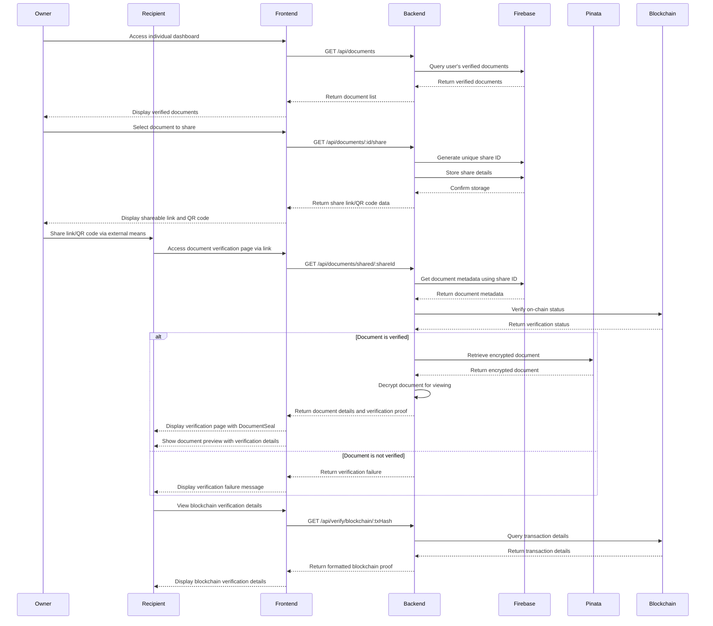

```mermaid
sequenceDiagram
    participant Owner
    participant Recipient
    participant Frontend
    participant Backend
    participant Firebase
    participant Pinata
    participant Blockchain

    Owner->>Frontend: Access individual dashboard
    Frontend->>Backend: GET /api/documents
    Backend->>Firebase: Query user's verified documents
    Firebase-->>Backend: Return verified documents
    Backend-->>Frontend: Return document list
    Frontend-->>Owner: Display verified documents

    Owner->>Frontend: Select document to share
    Frontend->>Backend: GET /api/documents/:id/share
    Backend->>Firebase: Generate unique share ID
    Backend->>Firebase: Store share details
    Firebase-->>Backend: Confirm storage
    Backend-->>Frontend: Return share link/QR code data
    Frontend-->>Owner: Display shareable link and QR code

    Owner->>Recipient: Share link/QR code via external means
    Recipient->>Frontend: Access document verification page via link
    Frontend->>Backend: GET /api/documents/shared/:shareId
    Backend->>Firebase: Get document metadata using share ID
    Firebase-->>Backend: Return document metadata
    Backend->>Blockchain: Verify on-chain status
    Blockchain-->>Backend: Return verification status

    alt Document is verified
        Backend->>Pinata: Retrieve encrypted document
        Pinata-->>Backend: Return encrypted document
        Backend->>Backend: Decrypt document for viewing
        Backend-->>Frontend: Return document details and verification proof
        Frontend-->>Recipient: Display verification page with DocumentSeal
        Frontend-->>Recipient: Show document preview with verification details
    else Document is not verified
        Backend-->>Frontend: Return verification failure
        Frontend-->>Recipient: Display verification failure message
    end

    Recipient->>Frontend: View blockchain verification details
    Frontend->>Backend: GET /api/verify/blockchain/:txHash
    Backend->>Blockchain: Query transaction details
    Blockchain-->>Backend: Return transaction details
    Backend-->>Frontend: Return formatted blockchain proof
    Frontend-->>Recipient: Display blockchain verification details
```
