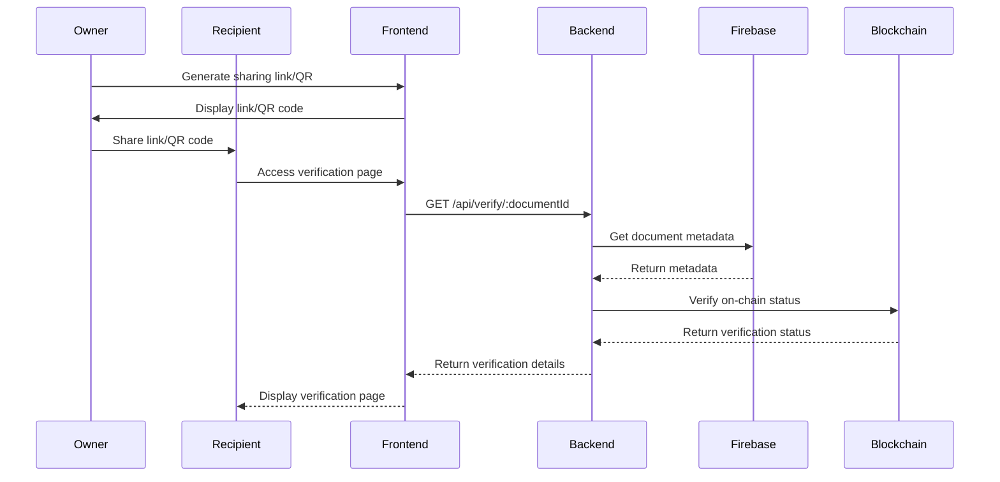

```mermaid
sequenceDiagram
    participant Owner
    participant Recipient
    participant Frontend
    participant Backend
    participant Firebase
    participant Blockchain

    Owner->>Frontend: Generate sharing link/QR
    Frontend->>Owner: Display link/QR code
    Owner->>Recipient: Share link/QR code
    Recipient->>Frontend: Access verification page
    Frontend->>Backend: GET /api/verify/:documentId
    Backend->>Firebase: Get document metadata
    Firebase-->>Backend: Return metadata
    Backend->>Blockchain: Verify on-chain status
    Blockchain-->>Backend: Return verification status
    Backend-->>Frontend: Return verification details
    Frontend-->>Recipient: Display verification page
```
