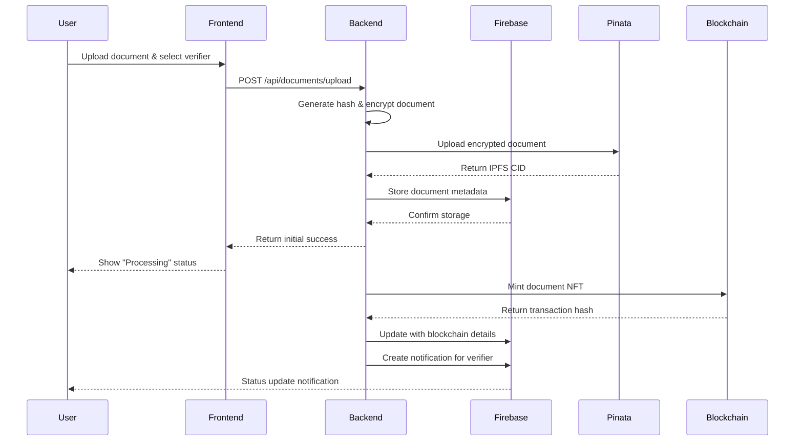

```mermaid
sequenceDiagram
    participant User
    participant Frontend
    participant Backend
    participant Firebase
    participant Pinata
    participant Blockchain

    User->>Frontend: Upload document & select verifier
    Frontend->>Backend: POST /api/documents/upload
    Backend->>Backend: Generate hash & encrypt document
    Backend->>Pinata: Upload encrypted document
    Pinata-->>Backend: Return IPFS CID
    Backend->>Firebase: Store document metadata
    Firebase-->>Backend: Confirm storage
    Backend-->>Frontend: Return initial success
    Frontend-->>User: Show "Processing" status
    Backend->>Blockchain: Mint document NFT
    Blockchain-->>Backend: Return transaction hash
    Backend->>Firebase: Update with blockchain details
    Backend->>Firebase: Create notification for verifier
    Firebase-->>User: Status update notification
```
