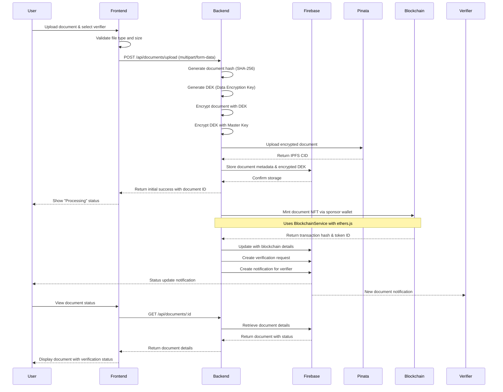

```mermaid
sequenceDiagram
    participant User
    participant Frontend
    participant Backend
    participant Firebase
    participant Pinata
    participant Blockchain
    participant Verifier

    User->>Frontend: Upload document & select verifier
    Frontend->>Frontend: Validate file type and size
    Frontend->>Backend: POST /api/documents/upload (multipart/form-data)
    Backend->>Backend: Generate document hash (SHA-256)
    Backend->>Backend: Generate DEK (Data Encryption Key)
    Backend->>Backend: Encrypt document with DEK
    Backend->>Backend: Encrypt DEK with Master Key
    Backend->>Pinata: Upload encrypted document
    Pinata-->>Backend: Return IPFS CID
    Backend->>Firebase: Store document metadata & encrypted DEK
    Firebase-->>Backend: Confirm storage
    Backend-->>Frontend: Return initial success with document ID
    Frontend-->>User: Show "Processing" status
    Backend->>Blockchain: Mint document NFT via sponsor wallet
    Note over Backend,Blockchain: Uses BlockchainService with ethers.js
    Blockchain-->>Backend: Return transaction hash & token ID
    Backend->>Firebase: Update with blockchain details
    Backend->>Firebase: Create verification request
    Backend->>Firebase: Create notification for verifier
    Firebase-->>User: Status update notification
    Firebase-->>Verifier: New document notification
    User->>Frontend: View document status
    Frontend->>Backend: GET /api/documents/:id
    Backend->>Firebase: Retrieve document details
    Firebase-->>Backend: Return document with status
    Backend-->>Frontend: Return document details
    Frontend-->>User: Display document with verification status
```
