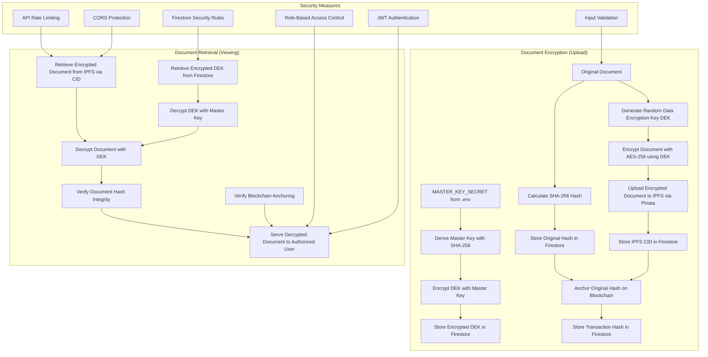

```mermaid
graph TD
    subgraph "Document Encryption (Upload)"
        A[Original Document] --> B[Calculate SHA-256 Hash]
        A --> C[Generate Random Data Encryption Key DEK]
        C --> D[Encrypt Document with AES-256 using DEK]
        E[MASTER_KEY_SECRET from .env] --> F[Derive Master Key with SHA-256]
        F --> G[Encrypt DEK with Master Key]
        D --> H[Upload Encrypted Document to IPFS via Pinata]
        G --> I[Store Encrypted DEK in Firestore]
        B --> J[Store Original Hash in Firestore]
        H --> K[Store IPFS CID in Firestore]
        J --> L[Anchor Original Hash on Blockchain]
        K --> L
        L --> M[Store Transaction Hash in Firestore]
    end

    subgraph "Document Retrieval (Viewing)"
        N[Retrieve Encrypted Document from IPFS via CID]
        O[Retrieve Encrypted DEK from Firestore]
        P[Decrypt DEK with Master Key]
        Q[Decrypt Document with DEK]
        R[Serve Decrypted Document to Authorized User]
        S[Verify Document Hash Integrity]
        T[Verify Blockchain Anchoring]

        N --> Q
        O --> P
        P --> Q
        Q --> S
        S --> R
        T --> R
    end

    subgraph "Security Measures"
        U[Role-Based Access Control]
        V[JWT Authentication]
        W[Firestore Security Rules]
        X[API Rate Limiting]
        Y[Input Validation]
        Z[CORS Protection]

        U --> R
        V --> R
        W --> O
        X --> N
        Y --> A
        Z --> N
    end
```
