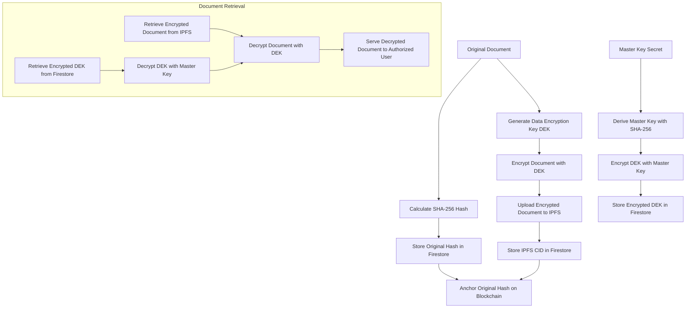

```mermaid
graph TD
    A[Original Document] --> B[Calculate SHA-256 Hash]
    A --> C[Generate Data Encryption Key DEK]
    C --> D[Encrypt Document with DEK]
    E[Master Key Secret] --> F[Derive Master Key with SHA-256]
    F --> G[Encrypt DEK with Master Key]
    D --> H[Upload Encrypted Document to IPFS]
    G --> I[Store Encrypted DEK in Firestore]
    B --> J[Store Original Hash in Firestore]
    H --> K[Store IPFS CID in Firestore]
    J --> L[Anchor Original Hash on Blockchain]
    K --> L
    
    subgraph "Document Retrieval"
        M[Retrieve Encrypted Document from IPFS]
        N[Retrieve Encrypted DEK from Firestore]
        O[Decrypt DEK with Master Key]
        P[Decrypt Document with DEK]
        Q[Serve Decrypted Document to Authorized User]
        
        M --> P
        N --> O
        O --> P
        P --> Q
    end
```
