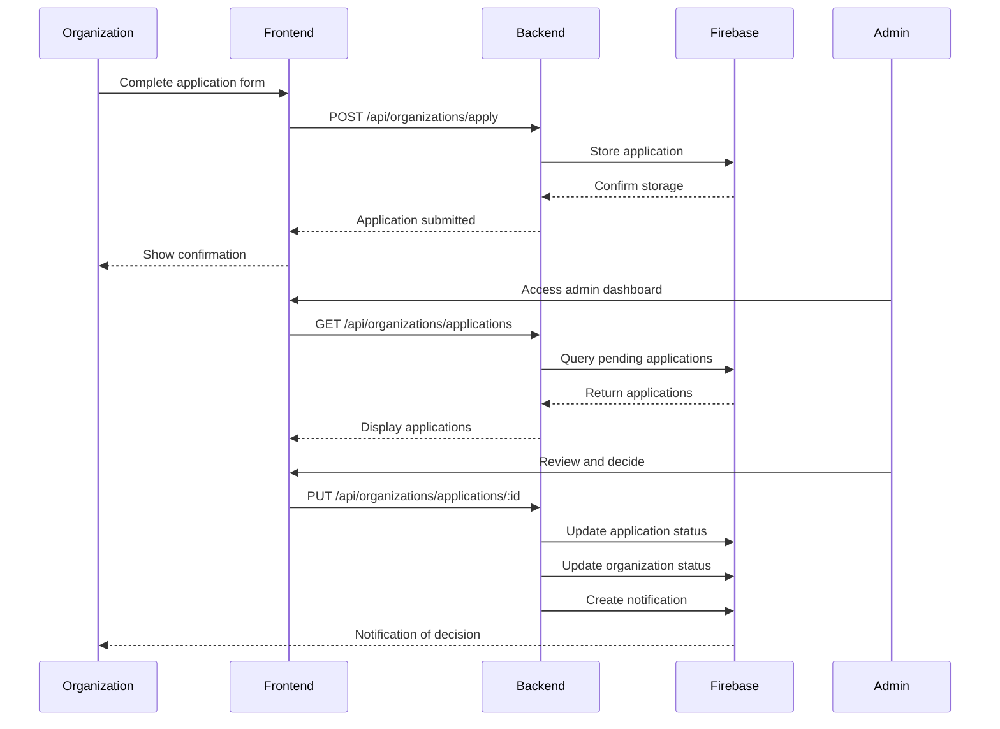

```mermaid
sequenceDiagram
    participant Organization
    participant Frontend
    participant Backend
    participant Firebase
    participant Admin

    Organization->>Frontend: Complete application form
    Frontend->>Backend: POST /api/organizations/apply
    Backend->>Firebase: Store application
    Firebase-->>Backend: Confirm storage
    Backend-->>Frontend: Application submitted
    Frontend-->>Organization: Show confirmation
    Admin->>Frontend: Access admin dashboard
    Frontend->>Backend: GET /api/organizations/applications
    Backend->>Firebase: Query pending applications
    Firebase-->>Backend: Return applications
    Backend-->>Frontend: Display applications
    Admin->>Frontend: Review and decide
    Frontend->>Backend: PUT /api/organizations/applications/:id
    Backend->>Firebase: Update application status
    Backend->>Firebase: Update organization status
    Backend->>Firebase: Create notification
    Firebase-->>Organization: Notification of decision
```
