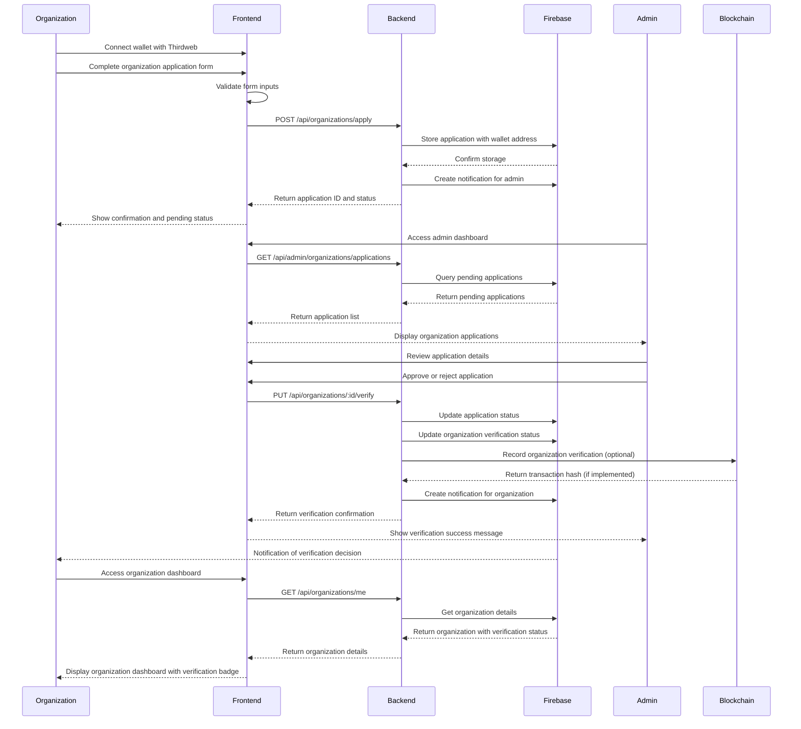

```mermaid
sequenceDiagram
    participant Organization
    participant Frontend
    participant Backend
    participant Firebase
    participant Admin
    participant Blockchain

    Organization->>Frontend: Connect wallet with Thirdweb
    Organization->>Frontend: Complete organization application form
    Frontend->>Frontend: Validate form inputs
    Frontend->>Backend: POST /api/organizations/apply
    Backend->>Firebase: Store application with wallet address
    Firebase-->>Backend: Confirm storage
    Backend->>Firebase: Create notification for admin
    Backend-->>Frontend: Return application ID and status
    Frontend-->>Organization: Show confirmation and pending status

    Admin->>Frontend: Access admin dashboard
    Frontend->>Backend: GET /api/admin/organizations/applications
    Backend->>Firebase: Query pending applications
    Firebase-->>Backend: Return pending applications
    Backend-->>Frontend: Return application list
    Frontend-->>Admin: Display organization applications

    Admin->>Frontend: Review application details
    Admin->>Frontend: Approve or reject application
    Frontend->>Backend: PUT /api/organizations/:id/verify
    Backend->>Firebase: Update application status
    Backend->>Firebase: Update organization verification status
    Backend->>Blockchain: Record organization verification (optional)
    Blockchain-->>Backend: Return transaction hash (if implemented)
    Backend->>Firebase: Create notification for organization
    Backend-->>Frontend: Return verification confirmation
    Frontend-->>Admin: Show verification success message

    Firebase-->>Organization: Notification of verification decision
    Organization->>Frontend: Access organization dashboard
    Frontend->>Backend: GET /api/organizations/me
    Backend->>Firebase: Get organization details
    Firebase-->>Backend: Return organization with verification status
    Backend-->>Frontend: Return organization details
    Frontend-->>Organization: Display organization dashboard with verification badge
```
