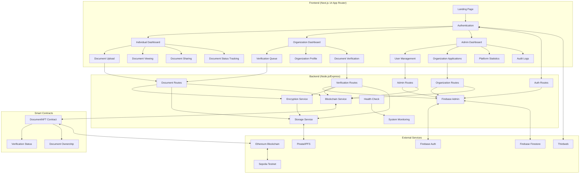

```mermaid
graph TD
    subgraph "Frontend (Next.js 14 App Router)"
        A[Landing Page] --> B[Authentication]
        B --> C[Individual Dashboard]
        B --> D[Organization Dashboard]
        B --> E[Admin Dashboard]
        C --> F[Document Upload]
        C --> G[Document Viewing]
        C --> H[Document Sharing]
        C --> C1[Document Status Tracking]
        D --> I[Verification Queue]
        D --> J[Organization Profile]
        D --> D1[Document Verification]
        E --> K[User Management]
        E --> L[Organization Applications]
        E --> E1[Platform Statistics]
        E --> E2[Audit Logs]
    end

    subgraph "Backend (Node.js/Express)"
        M[Auth Routes] --> N[Firebase Admin]
        O[Document Routes] --> P[Encryption Service]
        O --> Q[Storage Service]
        O --> R[Blockchain Service]
        S[Organization Routes] --> N
        S --> R
        T1[Verification Routes] --> N
        T1 --> R
        T1 --> P
        T1 --> Q
        U1[Admin Routes] --> N
        U1 --> R
        V1[Health Check] --> V2[System Monitoring]
    end

    subgraph "External Services"
        T[Firebase Auth]
        U[Firebase Firestore]
        V[Pinata/IPFS]
        W[Ethereum Blockchain]
        W1[Sepolia Testnet]
        X1[Thirdweb]
    end

    subgraph "Smart Contracts"
        X[DocumentNFT Contract]
        X2[Verification Status]
        X3[Document Ownership]
        X --> X2
        X --> X3
    end

    B <--> M
    B <--> X1
    F --> O
    I --> O
    D1 --> T1
    L --> S
    K --> U1
    N <--> T
    N <--> U
    P --> Q
    Q <--> V
    R <--> X
    X <--> W
    W <--> W1
```
