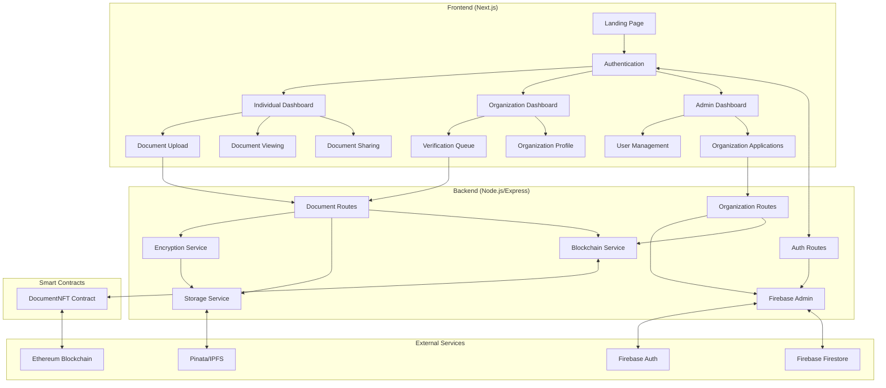

```mermaid
graph TD
    subgraph "Frontend (Next.js)"
        A[Landing Page] --> B[Authentication]
        B --> C[Individual Dashboard]
        B --> D[Organization Dashboard]
        B --> E[Admin Dashboard]
        C --> F[Document Upload]
        C --> G[Document Viewing]
        C --> H[Document Sharing]
        D --> I[Verification Queue]
        D --> J[Organization Profile]
        E --> K[User Management]
        E --> L[Organization Applications]
    end

    subgraph "Backend (Node.js/Express)"
        M[Auth Routes] --> N[Firebase Admin]
        O[Document Routes] --> P[Encryption Service]
        O --> Q[Storage Service]
        O --> R[Blockchain Service]
        S[Organization Routes] --> N
        S --> R
    end

    subgraph "External Services"
        T[Firebase Auth]
        U[Firebase Firestore]
        V[Pinata/IPFS]
        W[Ethereum Blockchain]
    end

    subgraph "Smart Contracts"
        X[DocumentNFT Contract]
    end

    B <--> M
    F --> O
    I --> O
    L --> S
    N <--> T
    N <--> U
    P --> Q
    Q <--> V
    R <--> X
    X <--> W
```
