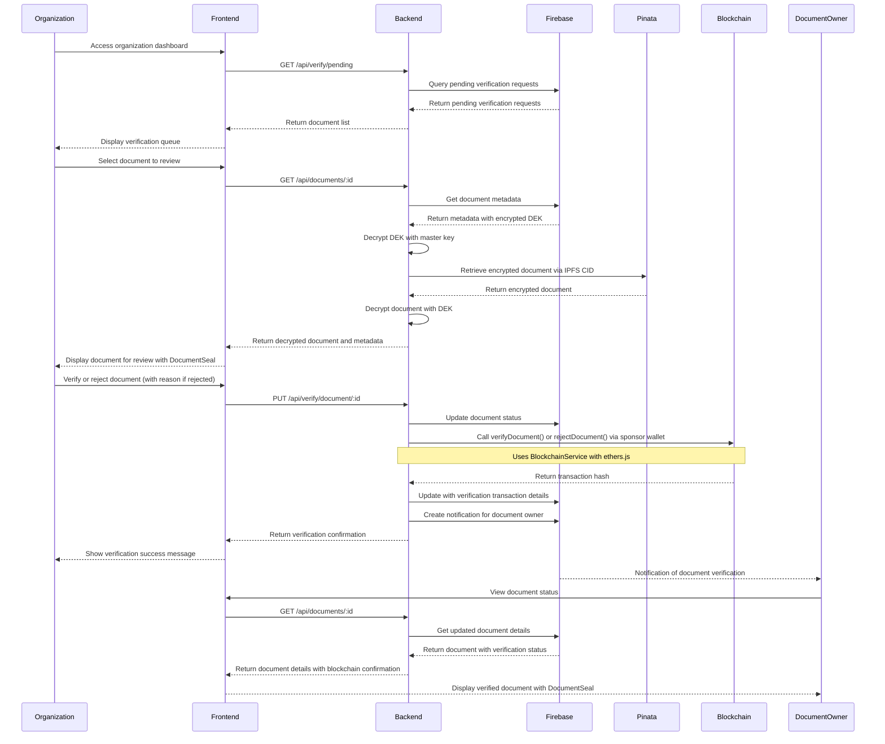

```mermaid
sequenceDiagram
    participant Organization
    participant Frontend
    participant Backend
    participant Firebase
    participant Pinata
    participant Blockchain
    participant DocumentOwner

    Organization->>Frontend: Access organization dashboard
    Frontend->>Backend: GET /api/verify/pending
    Backend->>Firebase: Query pending verification requests
    Firebase-->>Backend: Return pending verification requests
    Backend-->>Frontend: Return document list
    Frontend-->>Organization: Display verification queue

    Organization->>Frontend: Select document to review
    Frontend->>Backend: GET /api/documents/:id
    Backend->>Firebase: Get document metadata
    Firebase-->>Backend: Return metadata with encrypted DEK
    Backend->>Backend: Decrypt DEK with master key
    Backend->>Pinata: Retrieve encrypted document via IPFS CID
    Pinata-->>Backend: Return encrypted document
    Backend->>Backend: Decrypt document with DEK
    Backend-->>Frontend: Return decrypted document and metadata
    Frontend-->>Organization: Display document for review with DocumentSeal

    Organization->>Frontend: Verify or reject document (with reason if rejected)
    Frontend->>Backend: PUT /api/verify/document/:id
    Backend->>Firebase: Update document status
    Backend->>Blockchain: Call verifyDocument() or rejectDocument() via sponsor wallet
    Note over Backend,Blockchain: Uses BlockchainService with ethers.js
    Blockchain-->>Backend: Return transaction hash
    Backend->>Firebase: Update with verification transaction details
    Backend->>Firebase: Create notification for document owner
    Backend-->>Frontend: Return verification confirmation
    Frontend-->>Organization: Show verification success message

    Firebase-->>DocumentOwner: Notification of document verification
    DocumentOwner->>Frontend: View document status
    Frontend->>Backend: GET /api/documents/:id
    Backend->>Firebase: Get updated document details
    Firebase-->>Backend: Return document with verification status
    Backend-->>Frontend: Return document details with blockchain confirmation
    Frontend-->>DocumentOwner: Display verified document with DocumentSeal
```
