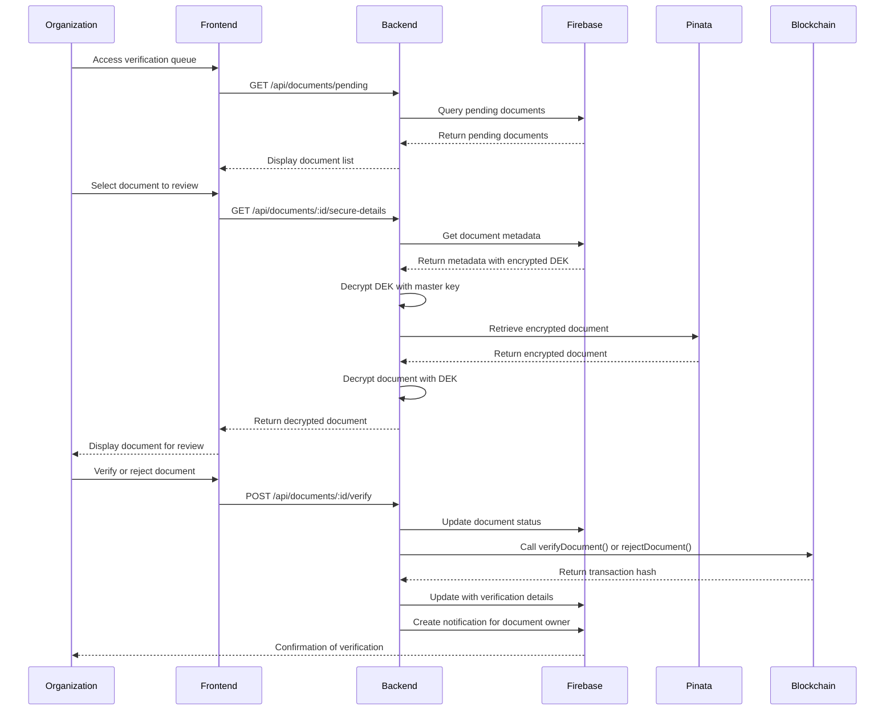

```mermaid
sequenceDiagram
    participant Organization
    participant Frontend
    participant Backend
    participant Firebase
    participant Pinata
    participant Blockchain

    Organization->>Frontend: Access verification queue
    Frontend->>Backend: GET /api/documents/pending
    Backend->>Firebase: Query pending documents
    Firebase-->>Backend: Return pending documents
    Backend-->>Frontend: Display document list
    Organization->>Frontend: Select document to review
    Frontend->>Backend: GET /api/documents/:id/secure-details
    Backend->>Firebase: Get document metadata
    Firebase-->>Backend: Return metadata with encrypted DEK
    Backend->>Backend: Decrypt DEK with master key
    Backend->>Pinata: Retrieve encrypted document
    Pinata-->>Backend: Return encrypted document
    Backend->>Backend: Decrypt document with DEK
    Backend-->>Frontend: Return decrypted document
    Frontend-->>Organization: Display document for review
    Organization->>Frontend: Verify or reject document
    Frontend->>Backend: POST /api/documents/:id/verify
    Backend->>Firebase: Update document status
    Backend->>Blockchain: Call verifyDocument() or rejectDocument()
    Blockchain-->>Backend: Return transaction hash
    Backend->>Firebase: Update with verification details
    Backend->>Firebase: Create notification for document owner
    Firebase-->>Organization: Confirmation of verification
```
